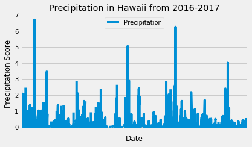

# <p align="center"> Climate Analysis of Stations in Hawaii with SQLAlchemy and Flask</p>


## Part 1: SQLAlchemy Object Relational Mapper


#### Initial Exploration and Analysis in [Jupyter Notebook](climate-analysis.ipynb)

```python
# import dependencies
%matplotlib inline
from matplotlib import style
style.use('fivethirtyeight')
import matplotlib.pyplot as plt
import numpy as np
import pandas as pd
import datetime as dt

# Python SQL toolkit and Object Relational Mapper
import sqlalchemy
from sqlalchemy.ext.automap import automap_base
from sqlalchemy.orm import Session
from sqlalchemy import create_engine, func, inspect, desc

# create engine with data
engine = create_engine("sqlite:///data/hawaii.sqlite")

# reflect an existing database into a new model
Base = automap_base()
# reflect the tables
Base.prepare(engine, reflect=True)

# We can view all of the classes that automap found
Base.classes.keys()
```


```python
# Save references to each table
Measurement = Base.classes.measurement
Station = Base.classes.station

# Create our session (link) from Python to the DB
session = Session(engine)
inspector = inspect(engine)
```


#### Precipitation Analysis

```python
# inspect measurement columns
columns = inspector.get_columns('measurement')
for c in columns:
    print(c['name'], c["type"])
```


```python
# calculate last data point in the database
latest_date = session.query(Measurement.date).order_by(Measurement.date.desc()).first()[0]
latest_date
```


```python
# date 1 year ago from latest_date 
year_ago = dt.datetime.strptime(latest_date,"%Y-%m-%d") - dt.timedelta(days=366)
year_ago
```


```python
# retrieve the data and precipitation scores
last_year = session.query(Measurement.date,Measurement.prcp).\
            filter(Measurement.date>=year_ago).all()


# save query results as a Pandas DataFrame and set the index to the date column, sort df by date
prcp_df = pd.DataFrame(last_year, columns=["Date","Precipitation"])
prcp_df["Date"] = pd.to_datetime(prcp_df["Date"], format="%Y-%m-%d")
prcp_df.set_index("Date", inplace=True)
sorted_df = prcp_df.sort_values(by="Date", ascending=True)
```


#### Plotting Precipitation Data

```python
# plotting with pandas is not showing max value when using bar but shows max when using line
sorted_df.plot(title="Precipitation in Hawaii from 2016-2017")
plt.xlabel("Date")
plt.ylabel("Precipitation Score")
plt.xticks([])
plt.legend(loc=9)
plt.savefig("images/prcp-line.png", bbox_inches="tight")

plt.show()
```



#### Summary Stats

```python
# show summary stats
sorted_df.describe()
```


#### Station Analysis

```python
# inspect station columns
cols = inspector.get_columns('station')
for c in cols:
    print(c['name'], c["type"])
```


```python
names = session.query(Station.station,Station.name).group_by(Station.station).all()
names
```


```python
# find how many stations
stations = session.query(Station.id)
stations.count()
```


```python
# query count of each station
active_stations = session.query(Measurement.station, func.count(Measurement.station)).\
                        group_by(Measurement.station).\
                        order_by(func.count(Measurement.station).desc()).all()
active_stations
```


```python
# find most active station for next query
most_active = session.query(Measurement.station, func.count(Measurement.station)).\
                        group_by(Measurement.station).\
                        order_by(func.count(Measurement.station).desc()).first()
most_active
```


```python
# query stats for most active station
most_active_stats = session.query(func.min(Measurement.tobs),
                                  func.max(Measurement.tobs),
                                  func.avg(Measurement.tobs)).\
                                filter(Measurement.station == most_active[0]).all()
most_active_stats
```


```python
# station with highest temp observations
highest_temps = session.query(Measurement.station,
                              func.count(Measurement.tobs)).\
                            group_by(Measurement.station).\
                            order_by(func.count(Measurement.station).desc()).first()
highest_temps
```


```python
# get the temp stats for the station with the highest temp observations
temps = session.query(Measurement.tobs).filter(Measurement.date >= year_ago).\
                        filter(Measurement.station == highest_temps[0]).all()
temps_df = pd.DataFrame(temps, columns=["Temperature"])
temps_df.head()
```


#### Plotting Temperature Data at Waihee Station
```python
# plot hist
temps_df.plot.hist(bins=12, title="Temperature Observations of WAIHEE Station (USC00519281)")
plt.savefig("images/waihee-temps.png", bbox_inches="tight")

plt.show()
```


## Part 2: API Routes with FLASK


#### Reference [app.py](app.py) for Flask routes using above analyses.


## Part 3: Future Analysis

#### Functions that can be used for future analysis of particular dates for taking a trip

I would like to use the following functions to plot the results instead of printing the results.

```python
# return the tmin, tmax, and tavg of the last years' data
def calc_temps(start_date, end_date):
    return session.query(func.min(Measurement.tobs), func.avg(Measurement.tobs), func.max(Measurement.tobs)).\
                        filter(Measurement.date >= start_date).filter(Measurement.date <= end_date).all()

start = str(year_ago)
end = latest_date
print(f"The minimum temperature was {calc_temps(start, end)[0][0]}"
      f", the maximum temperature was {calc_temps(start, end)[0][2]}"
     f", and the average temperature was {calc_temps(start, end)[0][1]}.")
```


```python
# calculate the daily normals (averages for tmin, tmax, and tavg for all historic data matching a specific month and day
def daily_normals(date):
    sel = [func.min(Measurement.tobs), func.avg(Measurement.tobs), func.max(Measurement.tobs)]
    return session.query(*sel).filter(func.strftime("%m-%d", Measurement.date) == date).all()
    
print(f"The minimum temperature was {daily_normals('12-31')[0][0]}"
      f", the maximum temperature was {daily_normals('12-31')[0][2]}"
     f", and the average temperature was {daily_normals('12-31')[0][1]}.")
```

